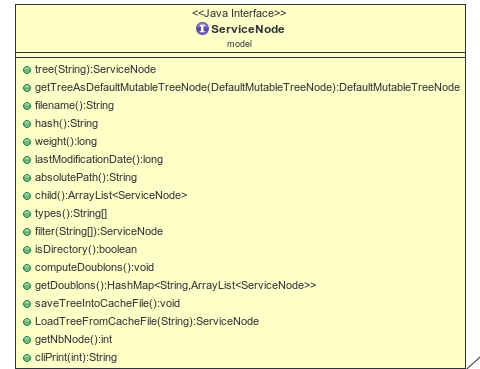
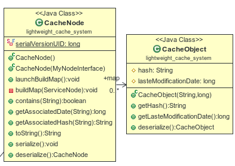
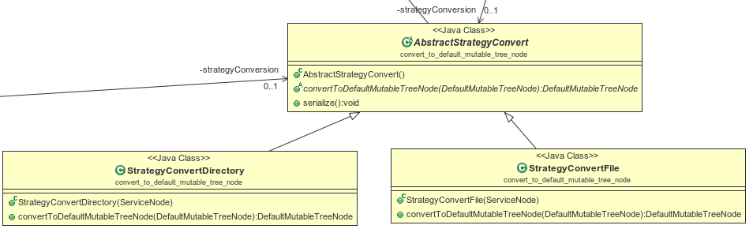

# Compte Rendu Back end

## Procédure de dev

### API
Au début du projet nous nous sommes attachés à définir une interface commune proposant un ensemble de services : getters, gestions des doublons, gestion des filtres. Cette interface fut la base de ma reflexion pour développer mon projet. C'est l'interface' [ServiceNode](../doc/model/ServiceNode.html) de mon projet.

### Architecture
J'ai fait le choix d'utiliser ma propre structure pour représenter l'arborescence. Je trouvais cela plus amusant et plus gratifiant d'utiliser du code fait maison plutôt que de me reposer sur une librairie qui me macherait le travail.

Je suis donc partir sur un patron composite comportant deux classes : [NodeDirectory](../doc/model/NodeDirectory.html) et [NodeFile](../doc/model/NodeFile.html) représentant respectivement un dossier/fichier de l'arborescence concernée. Afin de me simplifier la tâche ces deux classes implémentent une interface commune, [MyNodeInterface](../doc/model/MyNodeInterface.html) elle même héritant de [ServiceNode](../doc/model/ServiceNode.html). Dans cette interface j'ai pu définir l'ensemble des opérations communes aux membres du composite.

## Implémentation

### Création de l'arbre
La création de l'arbre s'appuie sur la methode listFiles de la classe [File](https://docs.oracle.com/javase/7/docs/api/java/io/File.html) de la librairie standard.
On parcourt récursivement l'arborescence en instanciant un [NodeDirectory](../doc/model/NodeDirectory.html) ou un [NodeFile](../doc/model/NodeFile.html) en fonction du besoin.

### Calcule des doublons
Afin de savoir si deux fichiers sont identiques, il est nécessaire de calculer leur hash. Pour cela j'ai utiliser un hash de type md5 à l'aide des [MessageDigest](https://docs.oracle.com/javase/7/docs/api/java/security/MessageDigest.html) de la librairie standard. Le calcul du hash est l'opération la plus couteuse du programme, c'est pourquoi son résultat est mis en cache.

### Cache
Dans une première version, je serializais l'arbre entièrement, sauvegardant ainsi entièrement son état. Cependant, le fichier de cache était énorme (plusieur centaines de MO), ce qui, au vu du nom du projet, semble contre productif. J'ai donc opté, pour un système beaucoup plus léger. Chaque noeud est représenté par un objet de type [CacheObject](../doc/lightweight_cache_system/CacheObject.html) portant uniquement son Hash et sa dernière date de modification. Un objet [CacheNode](../doc/lightweight_cache_system/CacheNode.html) agrège une collection de [CacheObject](../doc/lightweight_cache_system/CacheObject.html) au moyen d'une [Map](https://docs.oracle.com/javase/7/docs/api/java/util/HashMap.html) et c'est cette Map qui est sérialisée. Le fichier de cache est alors de taille beaucoup plus raisonnable.

### Filtrage de l'arbre.
Il était convenu qu'il soit possible de filtrer les fichiers que l'on souhaite traiter. Ainsi il doit être
possible à partir d'un point du système de fichiers de ne garder que certains types de fichiers.
Pour ce faire il est nécessaire de connaitre le type du fichier que l'on souhaitre traiter. C'est le seul
endroit où j'ai du faire appel à une librairie autre que la librairie standard. Mon choix s'est porté sur AppacheTika qui est bien documenté et facile à utiliser. Celle ci se base sur le MIME type du fichier et embarque sa propre banque de données ce qui la rend complètement indépendant du système.
Le seul bémol, cette librairie est très lourdre, les sources pèsent plus de 80 MO et je n'ai pas encore réussi à extraire la seule partie qui me sert.

### PartieGraphique
Pendant la définition de l'API, nous avons convenu de définir une methode renvoyant un [DefaultMutableTreeNode](https://docs.oracle.com/javase/7/docs/api/javax/swing/tree/DefaultMutableTreeNode.html) afin de pouvoir
par la suite utiliser un [JTree](https://docs.oracle.com/javase/7/docs/api/javax/swing/JTree.html) dans notre IHM. Pour ce faire je me suis amusé à faire un mini pattern Strategy, la conversion étant différante si il s'agit d'un [NodeDirectory](../doc/model/NodeDirectory.html) ou d'un [NodeFile](../doc/model/NodeFile.html).

## Lancement de l'application

java -jar ./jar/IlMeFautDeLaPlace.jar cheminVersArborescence

Laissez vous guider par le Menu.

- Il est necessaire d'hasher l'arbre avant de pouvoir détecter les doublons.
- Il est necessaire d'afficher tous les types de ficher contenus dans l'arbre avant de pouvoir filtrer ce dernier.
